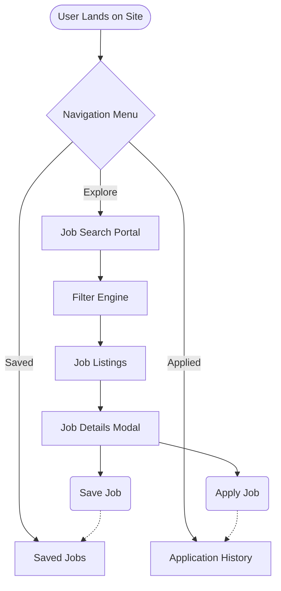
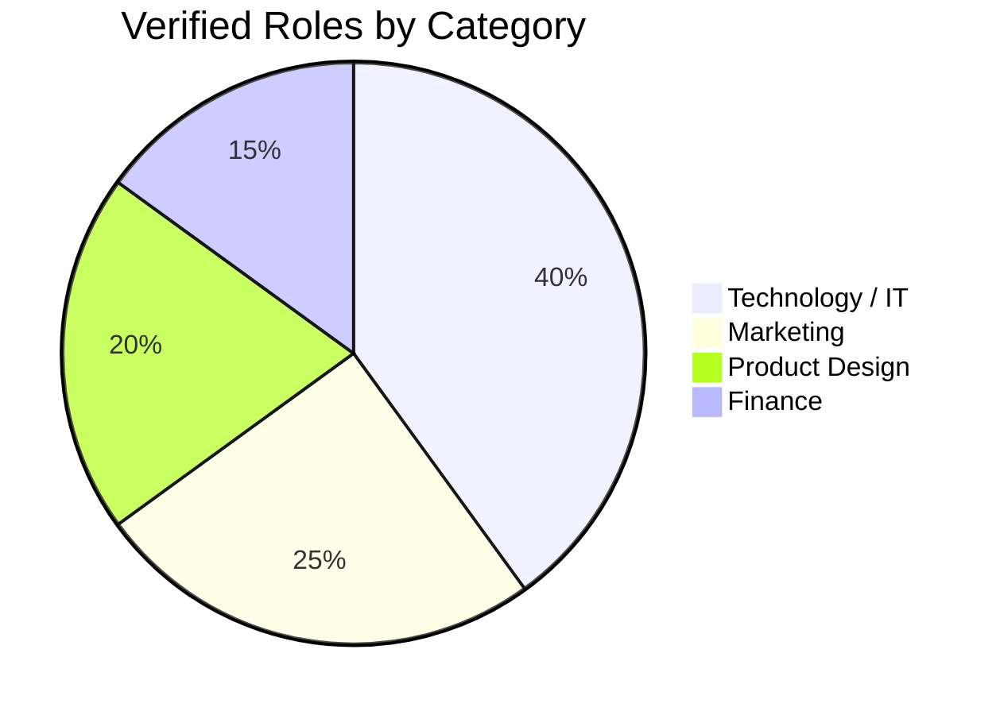
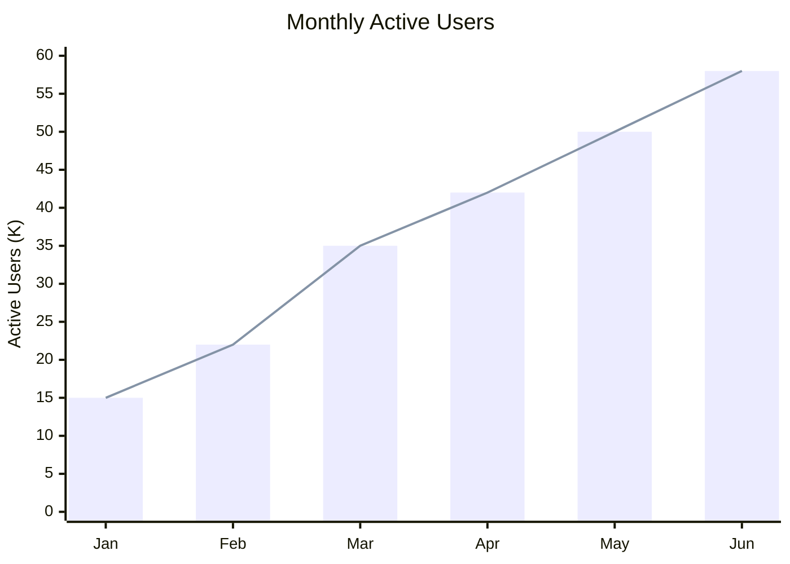

<div align="center">

# 🚀 JobSync.in

### 🇮🇳 India's Premium Professional Career Console

✨ **Search • Apply • Empower Your Career Journey**
Explore **3600+ Verified Opportunities** in one modern platform.


🌐 *A modern high-end job portal UI simulation built using pure frontend technologies.*

</div>

---

## 📌 Overview

**JobSync.in** is a sleek, fully responsive **front-end job portal application** designed to simulate a premium career platform experience.
The project focuses on advanced UI/UX principles, smooth user interaction, and real-time job exploration without requiring a backend.

It demonstrates how a modern recruitment platform works using clean architecture and dynamic client-side logic.

---

## ✨ Key Features

🔍 **Dynamic Job Engine**

* Instantly filter **3600+ jobs**
* Filter by Role, Category, and Experience Level

📱 **Responsive Navigation**

* Mobile-friendly hamburger menu
* Smooth transitions & animations

💼 **Activity Tracking**

* Explore Jobs
* Saved Jobs
* Applied History
* Browser state management

🎨 **Premium UI Experience**

* Glassmorphism design
* Floating animations
* Custom scrollbars
* Modern layout aesthetics

✉️ **Compact Contact Form**

* Footer integrated form
* Backend-free email handling via FormSubmit

💬 **Testimonial Carousel**

* Touch-friendly slider powered by Swiper.js

---

## 📊 Visual Architecture

### 🧭 User Journey Flow



### 📈 Job Distribution



### 🚀 Platform Growth Projection (2026)



---

## 💻 Tech Stack

| Technology         | Usage                       |
| ------------------ | --------------------------- |
| HTML5              | Semantic Structure          |
| Tailwind CSS       | Styling & Responsive Layout |
| Vanilla JavaScript | Logic & State Management    |
| Remix Icons        | Modern Vector Icons         |
| Swiper.js          | Sliders & Carousel          |
| FormSubmit         | Backend-free Email Handling |

---

## 📂 Project Structure

```
📦 JobSync.in
 ┣ 📜 index.html    → Core Layout & Navigation
 ┣ 📜 style.css     → Animations & Glass Effects
 ┣ 📜 app.js        → Data Engine & UI Logic
 ┗ 📜 README.md     → Documentation
```

---

## 🛠️ Quick Setup

### 1️⃣ Clone Repository

```bash
git clone https://github.com/yourusername/JobSync.in.git
```

### 2️⃣ Run Project

Open **index.html** in any modern browser.

✅ No installation required.

---

## 🎯 Project Goals

* Showcase advanced frontend engineering
* Build production-style UI architecture
* Practice modern UX design concepts
* Simulate real job portal workflows

---

## 🌟 Future Enhancements

* 🔐 Authentication System
* 🌐 Backend API Integration
* 🤖 AI Job Recommendations
* 📊 User Analytics Dashboard
* ☁️ Cloud Deployment

---

## 👨‍💻 Author

<div align="center">

### **Omm Prakash Samal**

🔗 https://github.com/yourusername

Built with ❤️ in India 🇮🇳

</div>

---

## 📄 License

Licensed under the **MIT License**.

---

<div align="center">

⭐ **If you like this project, give it a star!**

© 2026 JobSync India — All Rights Reserved

</div>
